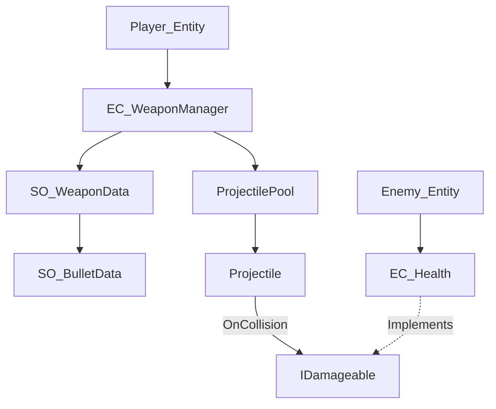

# Technical Design Document: Health, Damage & Weapon Systems

## 1. Overview
This document outlines the architecture for a high-performance combat system tailored for a fast-paced action game. It adheres to the project's custom component architecture (`AC_Entity`, `AC_Component`) and focuses on decoupling data from logic.

---

## 2. Damage System
To allow weapons to interact with any object (players, enemies, or environment) without tight coupling, we use an interface-based approach.

### `IDamageable` Interface
Implemented by any component that should respond to damage.
```csharp
public interface IDamageable {
    void TakeDamage(DamageInfo info);
}
```

### `DamageInfo` Struct
Contains all necessary data for a damage event.
```csharp
public struct DamageInfo {
    public float amount;
    public Vector3 hitPoint;
    public Vector3 hitNormal;
    public AC_Entity source; // The entity that dealt the damage
    public bool isCritical;
}
```

---

## 3. Health System (`EC_Health`)
An upgrade to the existing `EC_Health` to support segmented health, 100% mitigation shields, and interruptible Healing Over Time (HOT).

### Key Features
- **Segmented Health:** Inherited from the current implementation.
- **Shields:** Blocks 100% of incoming damage until value reaches 0.
- **HOT (Healing Over Time):**
    - Logic: `Heal(amount)` triggers a tick-based recovery.
    - **Interruption:** Any call to `TakeDamage()` clears active HOT effects.
- **Performance Optimization:**
    - Total health/shield values cached and updated only when changed, rather than recalculated every frame via properties.

### Component Logic
- `ComponentUpdate()`: Processes HOT ticks and optional shield regeneration timers.
- `TakeDamage(DamageInfo info)`: 
    1. Check Shields -> Reduce shield value.
    2. If Shield == 0 -> Apply remainder to Health segments sequentially.
    3. **Clear active HOT.**
    4. Invoke `OnDamage` event.

---

## 4. Weapon System
Separates the static stats (ScriptableObject) from the runtime state (Component).

### `SO_WeaponData` (Data Container)
- `GameObject VisualPrefab`: The model shown in hand.
- `AmmoCapacity`, `ReloadTime`, `FireRate`.
- `FireMode`: enum { Semi, Burst, Auto }.
- `WeaponType`: enum { Melee, Ranged }.
- `SO_BulletData`: Reference to the bullet this weapon fires.

### `EC_WeaponManager` (Logic Component)
- Manages `currentAmmo`, `isReloading`, and `fireTimer`.
- Listens to Input (`SO_InputAccess`).
- Handles the state machine for firing (preventing shooting during reload).

---

## 5. Bullet & Projectile System
Uses a Strategy pattern to handle different flight behaviors (Hitscan vs Projectile).

### `SO_BulletData` (Data Container)
- `float Damage`, `float Speed` (0 for hitscan).
- `GameObject VisualPrefab`: The projectile model or hitscan tracer.
- `BulletType`: enum { Hitscan, Projectile }.
- `LayerMask HitMask`: What the bullet can hit.

### Projectile Management (Object Pooling)
- **`ProjectilePool`:** A static or singleton manager.
- **Rules:** No `Instantiate` or `Destroy` calls during gameplay. Projectiles are requested from the pool and returned on hit or lifetime expiry.

---

## 6. Overall Structure & Dependencies



---

## 7. Performance Considerations
1. **Boxing:** `DamageInfo` is a struct to avoid heap allocations.
2. **Caching:** `EC_Health` will cache `MaxHealth` and `CurrentHealth` to avoid `O(N)` list traversals in properties.
3. **Physics:** Projectiles will use `Physics.Raycast` (Hitscan) or `FixedUpdate` movement (Projectile) to ensure deterministic hits at high speeds.
